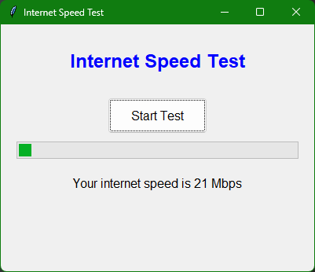

## License

This project is licensed under the MIT License. See the [LICENSE](LICENSE) file for details.

# Internet Speed Test GUI


## Overview

This project is a simple GUI application to test your internet speed using Selenium and BeautifulSoup. The GUI is built using Tkinter, and the speed test is run via [fast.com](https://fast.com).

## Features
- **Easy-to-use** GUI with a "Start Test" button.
- **Progress bar** to indicate the speed test is running.
- **Real-time** speed display after the test completes.
- **Headless** mode execution for faster performance.

<h1 align="center">
  
</h1>

## Installation

1. Clone the repository:
    ```bash
    git clone https://github.com/sidiq20/scrapedfast.com.git
    cd scrapedfast.com
    ```

2. Install the dependencies:
    ```bash
    pip install -r requirements.txt
    ```

3. Run the application:
    ```bash
    python main.py
    ```

## Building the Executable

To create an executable, use `pyinstaller`:
```bash
pyinstaller --onefile --noconsole main.py


